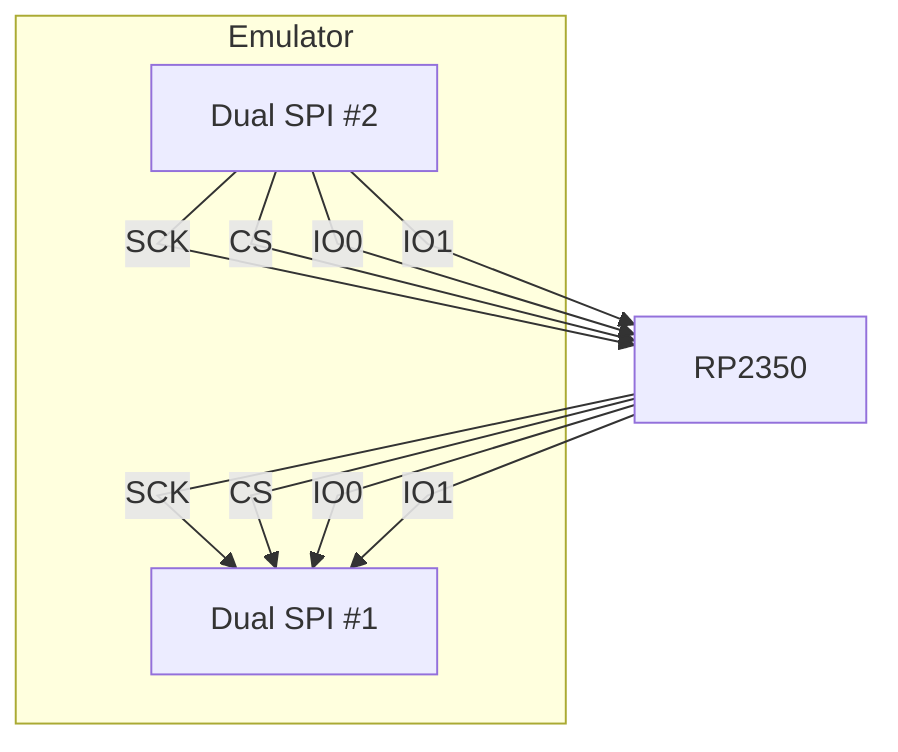

## Diagram

```mermaid 
---
config:
  flowchart:
    curve: linear
  theme: default
---
flowchart TB
    RP["RP2350"]

    subgraph EMU["Emulator"]
        direction LR
        DSPI1["Dual SPI #1"]
        DSPI2["Dual SPI #2"]
    end

    RP --SCK--> DSPI1
    RP --CS--> DSPI1
    RP --IO0--> DSPI1
    RP --IO1--> DSPI1

    DSPI2 --SCK--> RP
    DSPI2 --CS--> RP
    DSPI2 --IO0--> RP
    DSPI2 --IO1--> RP
```

## Dual SPI target #1 

## Dual SPI host #2

## target_SPI_decoder

## Tx instruction memory

## Rx instruction memory

## Tx FIFO
